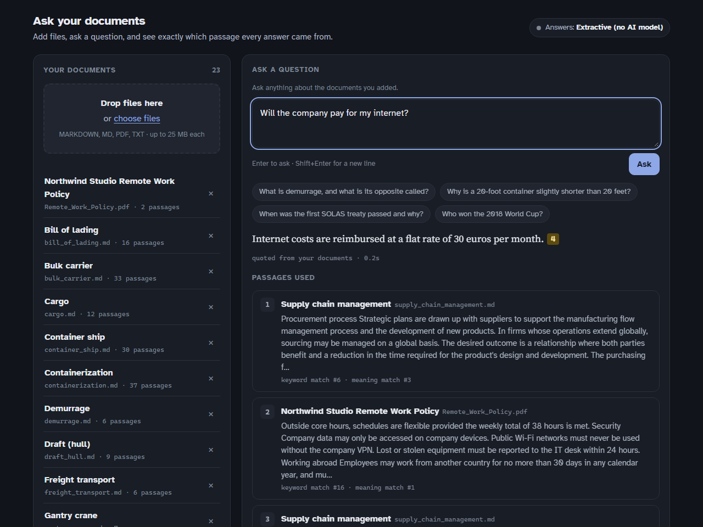

# Ask your documents

Add your own files — PDFs, text, Markdown — and ask questions about them in
plain language. Every answer shows exactly which passage it came from, and when
the answer isn't in your files, it says so instead of guessing.

It runs on your own computer. With no setup beyond installing it, nothing you
add ever leaves your machine.



---

## Get started

You need **Python 3.11 or newer**. If you don't have it, install it from
[python.org/downloads](https://www.python.org/downloads/) — on Windows, tick
**"Add python.exe to PATH"** during setup.

**1. Download this project.** Click the green **Code** button at the top of
this page, then **Download ZIP**, and unzip it anywhere. (Or, if you use git:
`git clone https://github.com/0yman/hybrid-rag-service`.)

**2. Start it.**

- **Windows:** double-click **`start-windows.bat`**.
- **Mac / Linux:** open a terminal in the folder and run `./start-mac-linux.sh`.

The first start sets everything up, which takes about two minutes and needs an
internet connection. After that it starts in a few seconds, and your browser
opens at **http://localhost:8000**.

**3. Use it.** Drag files onto the page — or click **Load sample documents**
to try it first on 22 articles about shipping and logistics — then type a
question. Click any highlighted number in an answer to jump to its source.

To stop the app, close the black window (or press Ctrl+C in it). Your
documents are kept for next time.

<details>
<summary>Prefer the command line?</summary>

```bash
pip install -r requirements.txt
python app.py              # opens http://localhost:8000
python app.py --port 9000  # a different port
```

Or with Docker: `docker compose up --build`.

</details>

---

## Better answers with a free AI key (optional)

Out of the box, answers **quote your documents directly**: the app finds the
sentences that best match your question and shows them, word for word. That
needs no account and never invents anything — but it can't summarise or
combine facts.

For written answers, add a free Google Gemini key:

1. Get one at [aistudio.google.com/apikey](https://aistudio.google.com/apikey)
   (no credit card).
2. In the project folder, copy **`.env.example`** to a new file named
   **`.env`**, open it, and paste the key after `GOOGLE_API_KEY=`.
3. Restart the app. The label at the top right changes to *Google Gemini*.

Any OpenAI-compatible provider works too (OpenAI, Groq, OpenRouter, a local
Ollama) — see the comments in `.env.example`.

**What gets sent:** with a key, your question and the few passages used to
answer it go to that provider. Your full documents never do. Without a key,
nothing leaves your computer.

If the free model is busy — which happens — the app doesn't fail: it answers
by quoting instead, and tells you so.

---

## Troubleshooting

| What you see | What to do |
|---|---|
| *"Python 3.11 or newer is needed"* | Install it from python.org, and on Windows tick "Add python.exe to PATH". |
| The first start seems stuck | It's downloading the search model (about 90 MB). Give it a minute. |
| *"no readable text found"* on a PDF | It's a scanned image, not text. Run it through OCR first (many PDF tools have "recognise text"). |
| *"Not in your documents"* but you know it is | Try wording the question the way the document does, or add a key for written answers. |
| Port 8000 is in use | The app picks the next free port automatically and prints it. |
| Setup failed partway | Delete the `.venv` folder in the project and run the start file again. |

---

## For developers

<details open>
<summary><b>How it works</b></summary>

```
question ─┬─▶ embed ──▶ FAISS (meaning) ──┐
          │                               ├─▶ Reciprocal Rank Fusion ──▶ top 5 passages ──▶ answer + [citations]
          └─▶ tokens ─▶ BM25 (keywords) ──┘                                                 └─ or "not in your documents"
```

- **Chunking** packs whole sentences into ~220-word passages with overlap, so
  a fact is never cut in half. PDFs are reflowed first: their text arrives one
  printed line at a time, with headings indistinguishable from sentences.
- **Retrieval** runs dense (MiniLM embeddings, FAISS) and lexical (BM25)
  search, then fuses the two rankings with RRF — ranks, not scores, because
  cosine and BM25 scores live on incomparable scales.
- **Answers** carry positional citations validated against the passages
  actually shown; a marker pointing at nothing is stripped. With no key, the
  extractive engine quotes the sentences closest *in meaning* to the question
  and declines below a similarity floor.
- **Everything is provider-agnostic**: Gemini, any OpenAI-format endpoint, or
  fully offline. Missing keys fail with a sentence saying what to do.

</details>

<details>
<summary><b>API</b></summary>

The web page is a thin client over a JSON API; interactive docs at `/docs`.

| Endpoint | |
|---|---|
| `POST /query` | Question in; answer, citations, every passage used with its keyword and meaning rank |
| `GET /documents` · `POST /documents` · `DELETE /documents/{id}` · `DELETE /documents` | List, upload (multipart), remove one, remove all |
| `POST /documents/sample` | Load the sample corpus |
| `GET /status` · `GET /health` | What the page needs to draw itself; liveness |

Uploads are restricted to `.pdf/.txt/.md`, size-capped, and saved under a
sanitised name — a crafted filename like `../../x.txt` cannot escape the
uploads folder. Re-uploading a file updates it instead of duplicating it.

</details>

<details>
<summary><b>Tests</b></summary>

161 tests, no network, no API key, a few seconds:

```bash
pip install -r requirements-dev.txt
python -m pytest
ruff check src eval scripts tests app.py
```

CI installs exactly what a user installs, runs the suite on Python 3.11 and
3.12, rebuilds the benchmark index, re-runs the evaluation, and fails the
build if recall, citation rate or abstention drop below a floor.

</details>

---

## Evaluation

The retrieval code is the ordinary part. The evaluation is what makes the
claims in this README checkable — and it has changed the design more than
once, including by contradicting me.

### The benchmark

A fixed corpus of 22 Wikipedia articles on shipping and logistics
(`data/benchmark/`, committed so results reproduce from a clean clone), with
two hand-written question sets — because users ask in more than one shape:

| Set | Looks like | Size |
|---|---|---|
| `eval/golden.jsonl` | natural questions — *"What is the inverse of demurrage called?"* | 31 answerable + 4 off-topic |
| `eval/golden_keyword.jsonl` | terse keyword queries — *"MARPOL STCW MLC conventions"* | 15 |

The benchmark is indexed separately from your documents, so evaluating never
touches them.

### Retrieval

Recall@3, under both runtimes that can load the embedding model (see below):

| Retriever | Natural · fastembed | Keyword · fastembed | Natural · sentence-transformers | Keyword · sentence-transformers |
|---|---|---|---|---|
| Dense only | 0.952 | 0.800 | 0.935 | **0.667** |
| BM25 only | 0.919 | **1.000** | 0.919 | **1.000** |
| Hybrid (RRF) | **0.968** | 0.867 | **0.968** | 0.867 |

Full tables with MRR, nDCG and a k-sweep: [`eval/results.md`](eval/results.md),
[`eval/results_keyword.md`](eval/results_keyword.md), and the
`*_sentence_transformers.md` files beside them.

**What holds under both:** dense retrieval drops sharply on keyword queries —
to 0.667 or 0.800 — exactly where BM25 is perfect. Its misses are the ones you
would predict: rare proper nouns and acronym strings (`MARPOL STCW MLC`,
`Rhakotis Pharos 1900 BC`). That is the case for keeping a lexical retriever
at all. And at k=3, BM25 alone has the best worst case (0.919) under either
runtime: fusion helps natural questions but inherits some of dense retrieval's
blind spot on keyword ones.

### The runtime changed the conclusion

The embedding model, `all-MiniLM-L6-v2`, can be run by two libraries.
`sentence-transformers` pulls in PyTorch — several gigabytes on Linux, which is
enough to lose someone who just wanted to try the app. `fastembed` runs the
same model on ONNX Runtime in about 15 MB. Switching was meant to be a
packaging change.

It wasn't. On real document chunks the two produce vectors that agree to a
cosine similarity of only ~0.88 on average (0.69 at worst) — short, clean test
sentences agree almost perfectly, which is exactly why a quick check missed
it. The evaluation caught it, and the effect was not small:

- dense recall on keyword queries at k=3 moved **13 points** (0.667 → 0.800);
- at k=5, which retriever is safest flipped: under sentence-transformers BM25
  alone has the best worst case (0.935 vs hybrid's 0.867); under fastembed,
  hybrid reaches **1.000 on both sets**.

So both are reported, the runtime is part of the embedder's name recorded in
the index (an index built by one is refused by the other, rather than searched
with vectors from a different space), and fastembed is the default because it
is what someone installing the app actually gets.

### The folder you cloned into changed the score

CI then disagreed with my laptop: keyword recall@3 for hybrid was 0.867 in CI
and 0.933 locally, with identical code. Dense and BM25 matched exactly; only
the fused ranking differed, on one query. The cause: when two passages tie on
rank-fusion score, the tie is broken by passage id — and ids were hashes of
each file's *absolute path*, `C:\Users\...` on one machine and `/home/runner/...`
on the other. Ids now come from the path relative to the indexed folder, a
test moves a corpus and asserts the ranking does not change, and the honest
number is the one that reproduces anywhere: 0.867. (That query sits on an
exact tie, which is itself worth knowing — at this corpus size, one tie is
6.7 points of recall.)

### Answers

| | fastembed | sentence-transformers |
|---|---|---|
| Declined off-topic questions | 1.000 | 1.000 |
| Answers with a valid citation | 1.000 | 1.000 |
| Expected facts present in the answer | 0.790 | 0.823 |

These are for the extractive engine — the no-key default — so they reproduce
exactly. Its first version matched sentences by shared words. Tested on
questions *paraphrased* the way a real user asks, that failed badly: "How long
does the warranty last?" shares one word with "The warranty covers defects for
twenty four months". Matching by meaning instead, with a similarity floor of
0.45, was better on every measure:

| Extractive, fastembed | Facts found (golden) | Facts found (paraphrased) | Off-topic declined |
|---|---|---|---|
| By shared words | 0.726 | 0.569 | 0.875 |
| **By meaning** | **0.790** | **0.625** | **1.000** |

The floor sits in the gap between the most similar off-topic question (0.40)
and the least similar real one (0.54) — a thin margin, chosen on this same
data, so it is a setting (`RAG_EXTRACTIVE_MIN_SIMILARITY`), not a constant.

One more thing the paraphrase test showed: the golden questions were written
by reading the source, so they naturally reuse its words — flattering to any
matcher that relies on them. A benchmark written that way understates how
often real questions are phrased differently.

### Reproduce

```bash
make eval-all        # default runtime (fastembed)
make eval-reference  # sentence-transformers; needs requirements-extras.txt
```

---

## Limitations

- **Small benchmark.** 46 queries over 22 documents. A few points between
  retrievers is noise; the dense-vs-BM25 gap on keyword queries is not.
- **Author-written questions**, which risks encoding the retriever's own
  assumptions — see the paraphrase finding above.
- **Extractive answers can only quote.** They can't combine two facts or
  answer "how many" by counting. Add a key for that.
- **Scanned PDFs need OCR first**; the app reads text, not images.
- **One user at a time.** It's built as a personal tool on your own machine,
  not a shared server.

## License

MIT. The benchmark articles are from Wikipedia, CC BY-SA 4.0, attributed in
each file.
